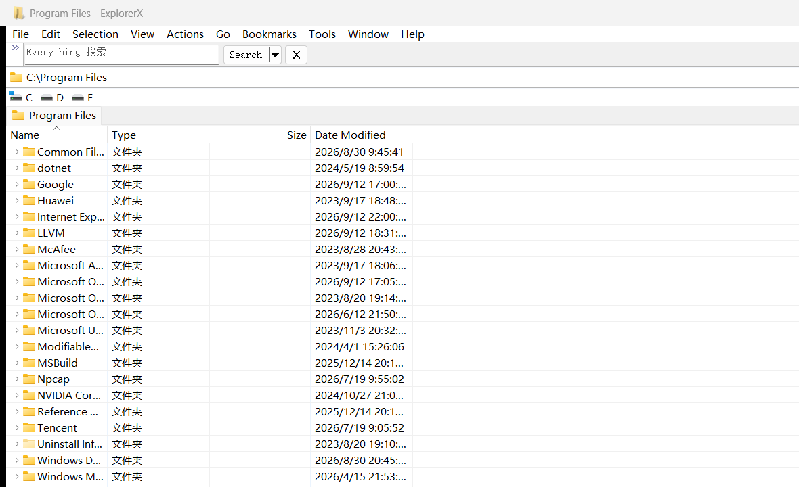

# ExplorerX

ExplorerX 是面向 Windows 的快速、便携文件管理器：保留原生 Shell 体验，同时针对多目录工作、快速查找和大目录浏览进行了增强。

[English](README.md)

## ExplorerX 带来了什么

| 场景 | ExplorerX 改进 |
| --- | --- |
| 快速定位文件 | 集成 [Everything](https://www.voidtools.com/) 搜索；搜索结果在独立标签页中打开，支持全局或当前目录范围。 |
| 跨目录处理文件 | 双面板与标签页可同时保留多个工作位置，适合复制、比较和整理。 |
| 浏览目录结构 | Details 视图支持类似 Directory Opus 的目录就地展开：点箭头或使用左右方向键即可展开/收起，不必离开当前列表。 |
| 浏览大目录 | 对本地物理目录采用快速枚举路径、响应式排序、扩展名图标缓存与按需恢复标签页，减少不必要的等待。 |
| 命令行工作流 | 可从当前文件夹打开 Windows Terminal。 |
| 保持 Windows 体验 | 完整复用 Windows 原生右键菜单和 Shell 扩展；7-Zip、Git、VS Code、WinRAR、杀毒软件等已安装扩展仍由系统处理。 |

## 主要功能

### Everything 搜索

- 通过 Everything IPC 查询，结果显示在可复用的结果标签页中。
- 可选择全局搜索或限定为当前文件夹，并保留常用匹配选项。
- 搜索、加载和排序不会以自定义菜单替换 Windows 原生文件操作。

### 双面板与标签页

- 在同一窗口中并排查看两个位置，配合标签页快速切换工作集。
- 适合文件复制、对照、归档等高频双目录操作。

### 类 Opus 的目录展开

- 在 Details 视图中，文件夹可在当前列表内展开成层级结构。
- 使用展开箭头，或通过键盘 `Right` 展开、`Left` 收起；无需反复进入和返回目录。
- 子项加载采用异步快速路径；层级排序、选择、拖放和原生 Shell 右键菜单继续可用。

### 原生而轻量的性能优化

- 本地物理目录使用基于 `GetFileInformationByHandleEx` 的批量快速读取；虚拟目录、网络位置、MTP 等仍走兼容的 Shell 路径。
- 通过零拷贝排序、扩展名图标缓存、延迟标签页恢复和配置脏标记，降低启动和大目录操作中的多余工作。
- 不引入常驻服务；慢速或失败的外部调用不会阻塞主界面。

### 便携使用

ExplorerX 支持注册表配置，也支持将配置文件放在程序旁边，便于放入 U 盘或独立工作目录使用。

## 截图说明

上图为 ExplorerX 的真实运行截图：右上角为 Everything 搜索入口，中间保留多标签工作区；列表仍使用 Windows Shell 的 Details 视图和原生项目类型信息。双面板和目录就地展开见上方功能说明。

## 构建

ExplorerX 使用 Visual Studio 2022 Build Tools 和 Windows SDK 构建。便携的命令行构建方法请参阅 [BUILDING.md](BUILDING.md)。

## 上游项目与许可证

ExplorerX 是 [Explorer++](https://github.com/derceg/explorerplusplus) 的独立维护修改版，原作者为 David Erceg。ExplorerX 的功能修改和维护者为 Hank Li。

ExplorerX 采用 GNU General Public License v3.0。源代码中的原始版权声明和许可证条款均被保留；分发二进制文件时，请依据 GPL-3.0 同时提供对应源代码。
