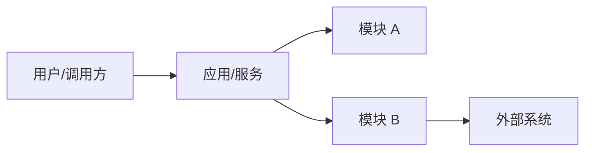
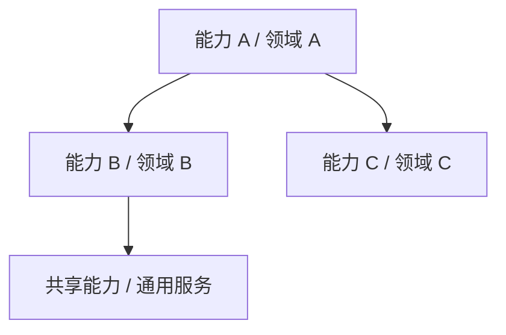
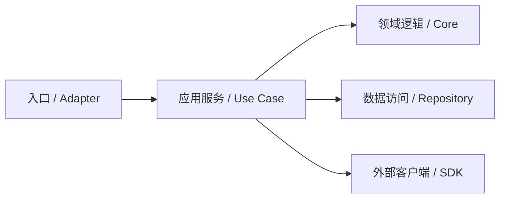
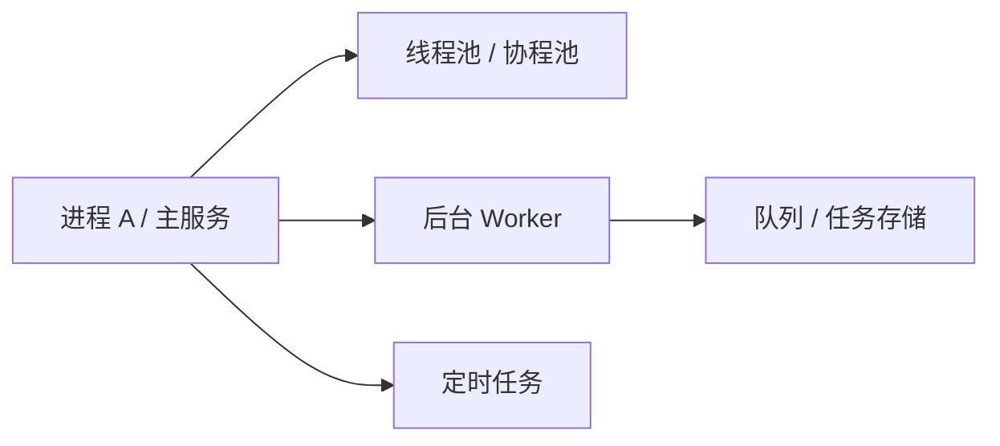
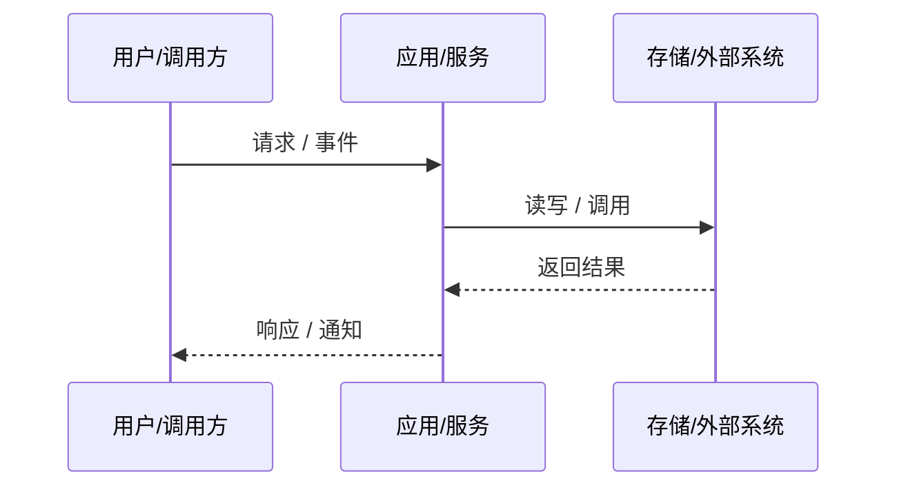
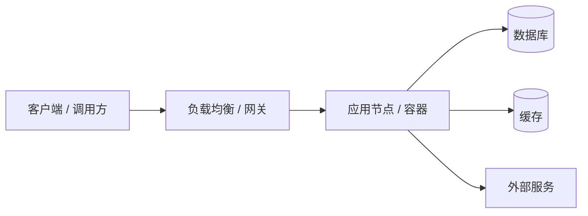

# [项目/系统名称] 架构概览

## 目标

> 一句话说明系统要完成的核心闭环。

## 非目标

- 明确当前阶段不处理的范围。

## 系统边界

**系统内：**
- 模块 A
- 模块 B

**系统外：**
- 外部服务 X
- 第三方组件 Y

## 顶层视图

> 用一张图说明系统与用户、外部系统、核心能力之间的关系。更细的视图放在后续章节。

## 逻辑架构视图 (Logical Architecture)

> 从业务能力、领域对象和系统职责角度描述“系统由哪些逻辑部分组成”，不绑定具体代码目录或进程。

| 逻辑组件 / 领域 | 职责 | 关键输入 | 关键输出 | 不负责 |
|-----------------|------|----------|----------|--------|
| TODO | TODO | TODO | TODO | TODO |

## 实现架构视图 (Implementation Architecture)

> 从代码组织、模块依赖、接口边界和复用关系角度描述“系统如何在代码中实现”。

| 代码模块 / 包 | 职责 | 主要入口 | 依赖 | 对外契约 |
|---------------|------|----------|------|----------|
| TODO | TODO | TODO | TODO | TODO |

### 模块依赖规则

- 允许依赖：TODO，例如 `adapter -> service -> domain`。
- 禁止依赖：TODO，例如 `domain` 不直接依赖外部 SDK。
- 共享代码边界：TODO，例如通用工具、错误码、配置读取。

## 运行架构视图 (Runtime / Physical Architecture: Processes & Threads)

> 从运行时进程、线程、任务队列、后台 worker、定时任务和并发模型角度描述“系统运行起来是什么样”。

| 运行单元 | 类型 | 职责 | 启动方式 | 并发模型 | 失败处理 |
|----------|------|------|----------|----------|----------|
| TODO | 进程 / 线程 / 协程 / Worker / 定时任务 | TODO | TODO | TODO | TODO |

### 关键运行机制

- 启动顺序：TODO
- 关闭 / 优雅退出：TODO
- 并发与锁：TODO
- 队列 / 后台任务：TODO
- 重试 / 补偿：TODO
- 资源限制：TODO（CPU、内存、连接池、线程池、文件句柄等）

## 关键数据流

1. 输入从哪里来。
2. 核心模块如何处理。
3. 输出写到哪里或返回给谁。
4. 失败路径如何反馈和恢复。

## 物理架构视图 (Deployment Architecture)

> 从机器、容器、网络、存储、中间件和外部服务角度描述“系统部署在哪里、依赖什么、如何通信”。

| 节点/进程 | 职责 | 依赖 | 备注 |
|-----------|------|------|------|
| TODO | TODO | TODO | TODO |

### 网络与部署边界

- 环境：TODO（本地 / 测试 / 预发 / 生产）
- 网络入口：TODO（域名、网关、端口、协议）
- 存储依赖：TODO（数据库、缓存、对象存储、消息队列）
- 外部服务：TODO
- 密钥 / 配置来源：TODO
- 扩缩容方式：TODO
- 回滚方式：TODO

## 技术栈

| 类别 | 技术 | 选择原因 |
|------|------|----------|
| 语言 | TODO | TODO |
| 构建 | TODO | TODO |
| 测试 | TODO | TODO |
| 存储 | TODO | TODO |

## 关键约束

- 性能约束：TODO
- 兼容性约束：TODO
- 安全约束：TODO
- 运维约束：TODO

## 相关文档

- Overview: `../00_overview/OVERVIEW-000_overview_template.md`
- AI Context: `../00_overview/AICTX-000_ai_context_template.md`
- Contract: `../02_contracts/API-000_api_contract_template.md`
- Module: `../03_modules/MOD-000_module_template.md`
- Feature: `../04_features/FEAT-000_feature_template.md`
- LLD: `../06_lld/LLD-000_lld_template.md`
- ADR: `../07_decisions/ADR-000_adr_template.md`
