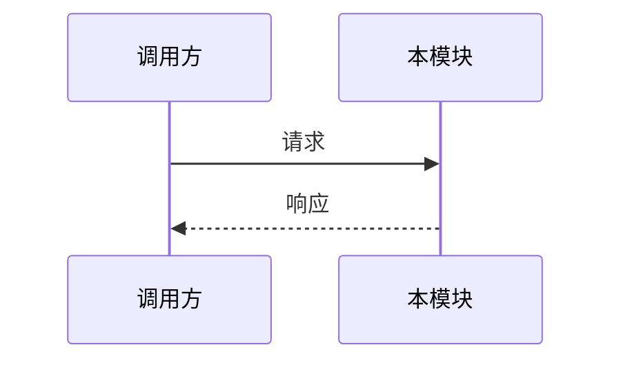

# [模块名称]

## 模块职责

> 一句话说明这个模块负责什么，不负责什么。

### 负责

- TODO

### 不负责

- TODO，该职责属于 `./xxx_other_module.md`

---

## 边界与依赖

| 类型 | 名称 | 方向 | 用途 |
|------|------|------|------|
| 内部模块 | TODO | 调用 / 被调用 | TODO |
| 外部库 / 服务 | TODO | 调用 / 被调用 | TODO |

---

## 对外接口

| 接口 / 入口 | 调用方 | 输入 | 输出 | 错误 / 异常 | 兼容性要求 |
|-------------|--------|------|------|-------------|------------|
| TODO | TODO | TODO | TODO | TODO | TODO |

> 如有独立接口契约文档，在此放路径：`../02_contracts/xxx.md`

---

## 关键行为

- 正常路径：TODO
- 失败路径：TODO
- 重试 / 补偿：TODO
- 幂等 / 并发：TODO
- 安全 / 权限：TODO

---

## 内部设计

> 只记录"为什么这样做"和"哪里容易误解"，不要逐行复述代码。

### 核心逻辑

TODO

### 关键数据结构

```text
StructureName
- field_a: 类型，含义
- field_b: 类型，含义
```

### 状态机 / 时序



---

## 错误处理与可观测性

- 错误码 / 异常：TODO
- 关键日志：TODO
- 指标 / tracing：TODO
- 排障入口：TODO

---

## 测试策略

- 单元测试：TODO
- 集成测试：TODO
- 回归测试：TODO
- 手工验证：TODO

---

## 已知限制 / TODO

- [ ] TODO

---

## 变更历史

> 按时间倒序，每条链接到对应的 Memory 文档。

| 日期 | 变更摘要 | Breaking | Memory |
|------|----------|----------|--------|
| YYYY-MM-DD HH:MM:SS | TODO | 否 | `../../memory/YYYY-MM-DD_HHMMSS_xxx.md` |
