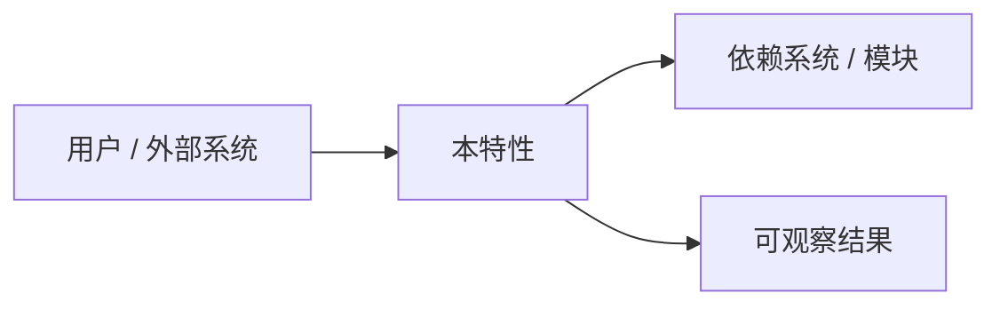
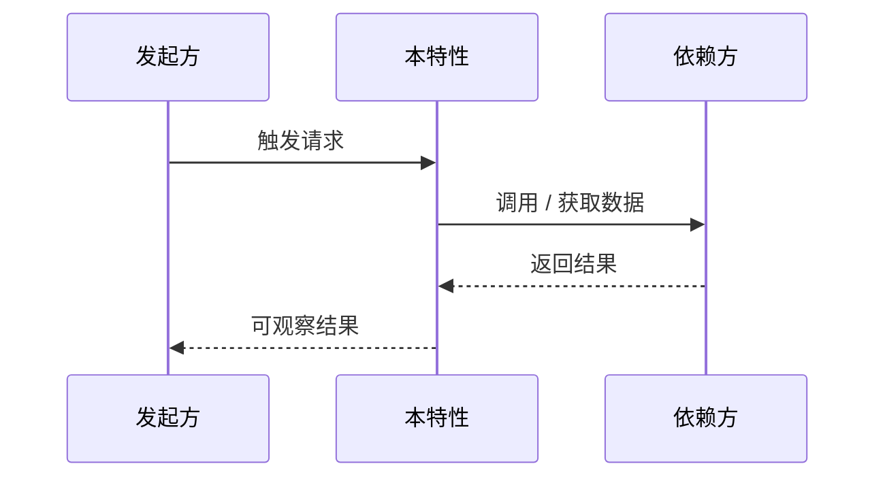

# FEAT-000: [特性名称] 特性设计

> 本文定义特性的范围、原理、行为、工程使用方式与验收依据。复杂模块内部实现见 LLD；跨系统契约见 API Contract；重大技术取舍见 ADR。无关章节填 `N/A`，不要保留空泛 TODO。

## 1. 文档介绍

### 1.1 文档范围

> 本文覆盖哪些子特性、版本、部署形态或用户群；明确不覆盖什么。

- 覆盖范围：TODO
- 不覆盖范围：TODO / N/A
- 适用版本 / 环境：TODO

### 1.2 目标读者

| 角色 | 需要从本文获得的信息 |
|------|----------------------|
| 产品 / 业务 | TODO |
| 开发 / 架构 | TODO |
| 测试 / 运维 | TODO / N/A |

### 1.3 变更记录

| 时间 | 类型 | 变更说明 | 影响范围 |
|------|------|----------|----------|
| YYYY-MM-DD HH:MM:SS | 初版 | TODO | TODO |

### 1.4 适用差异

| 部署形态 / 租户 / 版本 | 是否适用 | 差异说明 |
|------------------------|----------|----------|
| TODO | 是 / 否 / 部分 | TODO |

## 2. 概述

### 2.1 定义与问题陈述

> 该特性是什么，为谁解决什么问题；用业务语言描述，不抢占 LLD 的实现细节。

TODO

### 2.2 目标与预期增益

| 目标 | 当前问题或基线 | 完成后的可观察结果 | 衡量方式 |
|------|----------------|--------------------|----------|
| TODO | TODO | TODO | TODO |

### 2.3 非目标

- TODO：当前阶段明确不处理的用户、场景、能力或优化。

### 2.4 系统位置与上下游

| 参与者 / 系统 | 与本特性的关系 | 输入 / 输出 | 责任边界 |
|---------------|----------------|-------------|----------|
| TODO | TODO | TODO | TODO |

## 3. 特性设计

### 3.1 特性清单

> 一个设计文档含多个子特性时，逐项列出；单一特性保留一行即可。

| ID | 子特性 | 用户价值 | 优先级 | 状态 |
|----|--------|----------|--------|------|
| FEAT-000-01 | TODO | TODO | P1 | draft |

### 3.2 角色、权限与前置条件

| 角色 / 系统 | 可执行动作 | 所需权限 | 前置条件 |
|-------------|------------|----------|----------|
| TODO | TODO | TODO | TODO |

### 3.3 场景与主流程

| 场景 | 触发条件 | 用户 / 系统动作 | 预期结果 | 优先级 |
|------|----------|------------------|----------|--------|
| TODO | TODO | TODO | TODO | P0 |

### 3.4 业务规则与边界

| 规则 ID | 规则 / 边界 | 正常行为 | 违反时的处理 |
|---------|-------------|----------|--------------|
| R-001 | TODO | TODO | TODO |

### 3.5 状态、生命周期与并发

> 涉及状态迁移、异步任务、重入或并发控制时填写；否则填 `N/A`。

| 当前状态 | 触发事件 | 下一状态 | 幂等 / 并发要求 | 超时或退出行为 |
|----------|----------|----------|-----------------|----------------|
| TODO | TODO | TODO | TODO | TODO |

### 3.6 异常、降级与恢复

| 场景 | 检测方式 | 系统行为 | 用户可见反馈 | 重试 / 补偿 / 人工处理 |
|------|----------|----------|--------------|------------------------|
| TODO | TODO | TODO | TODO | TODO |

### 3.7 数据、配置与对外契约

| 类型 | 名称 | 变更 / 使用方式 | 兼容性要求 | 详细来源 |
|------|------|-----------------|------------|----------|
| 数据 | TODO | TODO | TODO | LLD / Schema |
| 配置 / 参数 | TODO | TODO | TODO | Runbook / 配置文档 |
| API / 事件 | TODO | TODO | TODO | API Contract |

### 3.8 安全、隐私与合规

- 身份认证与授权：TODO / N/A
- 数据分级、脱敏与保留期限：TODO / N/A
- 审计、合规或监管要求：TODO / N/A

## 4. 相关特性与影响评估

### 4.1 依赖、协同与冲突

| 特性 / 模块 / 外部系统 | 关系 | 依赖或冲突说明 | 处理方式 |
|------------------------|------|----------------|----------|
| TODO | TODO | TODO | TODO |

### 4.2 影响评估

| 影响面 | 影响说明 | 风险等级 | 缓解措施 |
|--------|----------|----------|----------|
| 用户体验 | TODO / N/A | low / medium / high | TODO |
| 性能 / 容量 | TODO / N/A | low / medium / high | TODO |
| 数据 / 兼容性 | TODO / N/A | low / medium / high | TODO |
| 运维 / 支持 | TODO / N/A | low / medium / high | TODO |

## 5. 工程指导

### 5.1 开通与部署要求

- 前置依赖：TODO / N/A
- 数据准备：TODO / N/A
- 配置 / 参数准备：TODO / N/A
- 上线顺序、灰度范围和成功判据：TODO / N/A

### 5.2 激活、去激活与回滚

| 操作 | 执行条件 | 操作步骤或 Runbook | 成功判据 | 回退方式 |
|------|----------|--------------------|----------|----------|
| 激活 | TODO | TODO | TODO | TODO |
| 去激活 / 回滚 | TODO | TODO | TODO | TODO |

### 5.3 观测、监控与告警

| 信号 | 名称 / 位置 | 正常范围 | 告警或排查阈值 | 用途 |
|------|-------------|----------|----------------|------|
| 日志 | TODO | TODO | TODO | TODO |
| 指标 | TODO | TODO | TODO | TODO |
| 链路追踪 / 审计 | TODO / N/A | TODO | TODO | TODO |

### 5.4 参数调优与故障处理

| 现象 | 优先检查项 | 常见原因 | 处理或调优方式 | 升级条件 |
|------|------------|----------|----------------|----------|
| TODO | TODO | TODO | TODO | TODO |

## 6. 验收与质量要求

### 6.1 验收场景

| 场景 | 前置条件 | 操作 | 预期结果 | 证据 |
|------|----------|------|----------|------|
| 正常路径 | TODO | TODO | TODO | 测试 / 截图 / 日志 |
| 关键边界 | TODO | TODO | TODO | TODO |
| 失败与恢复 | TODO | TODO | TODO | TODO |

### 6.2 非功能要求

| 类别 | 要求 | 验证方式 |
|------|------|----------|
| 性能 / 容量 | TODO / N/A | TODO |
| 可用性 / 可靠性 | TODO / N/A | TODO |
| 安全 | TODO / N/A | TODO |
| 可观测性 | TODO / N/A | TODO |

## 7. 已知限制、术语与参考

### 7.1 已知限制与待确认项

- [ ] TODO / N/A

### 7.2 术语与缩略语

| 术语 | 含义 |
|------|------|
| TODO | TODO |

### 7.3 相关文档

- Task：`../05_tasks/TASK-XXX_xxx.md` / N/A
- LLD：`../06_lld/LLD-XXX_xxx.md` / N/A
- ADR：`../07_decisions/ADR-XXX_xxx.md` / N/A
- API Contract：`../02_contracts/API-XXX_xxx.md` / N/A
- Module：`../03_modules/MOD-XXX_xxx.md` / N/A
- Runbook：`../08_runbooks/RUNBOOK-XXX_xxx.md` / N/A
- 外部参考：`../10_references/REF-XXX_xxx.md` / N/A
