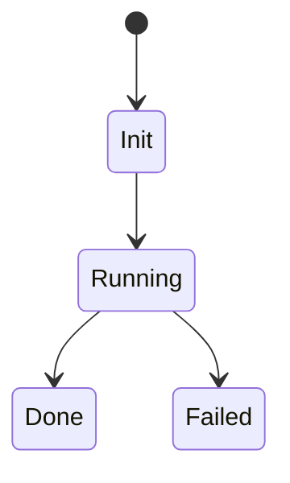
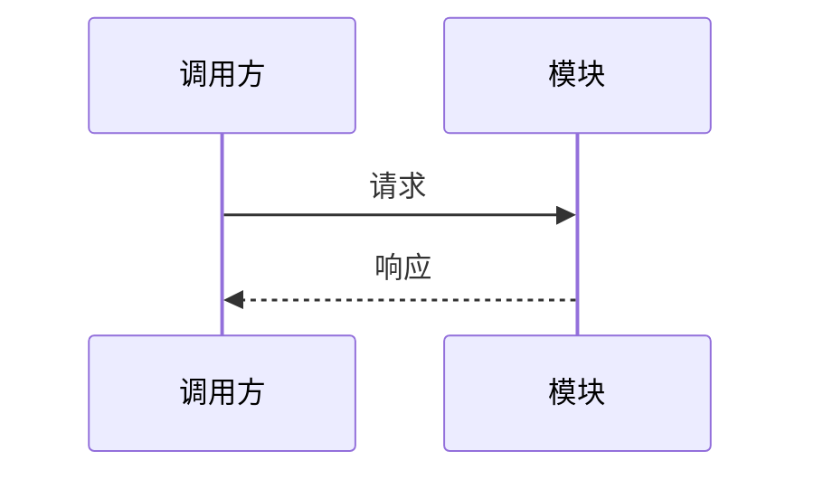

# [功能/模块名称] 低层设计 (LLD)

## 背景

> 为什么需要这份 LLD？它细化哪份 Feature、ADR 或 Task？

- Feature: TODO
- ADR: TODO
- Task: TODO

## 设计目标

- TODO

## 非目标

- TODO

---

## 接口设计

### 对外接口

| 接口 | 入参 | 出参 | 错误/异常 | 说明 |
|------|------|------|-----------|------|
| TODO | TODO | TODO | TODO | TODO |

### 内部接口

| 接口 | 调用方 | 被调用方 | 说明 |
|------|--------|----------|------|
| TODO | TODO | TODO | TODO |

---

## 数据结构

```text
StructName
- field_a: 类型，含义
- field_b: 类型，含义
```

---

## 状态机 / 流程



---

## 关键时序



---

## 异常处理

| 场景 | 检测方式 | 处理方式 | 是否重试 | 日志/指标 |
|------|----------|----------|----------|-----------| 
| TODO | TODO | TODO | TODO | TODO |

---

## 性能与容量

- 延迟目标：TODO（如：P99 < 200ms）
- 吞吐量目标：TODO（如：峰值 1000 req/s）
- 资源预估：TODO（CPU / 内存 / 存储 / 网络带宽）
- 瓶颈预判：TODO（哪个环节最可能成为瓶颈）
- 降级策略：TODO（超载或依赖不可用时的兜底行为）
- 压测计划：TODO（何时做，用什么工具，验收标准是什么）

---

## 兼容性与迁移

- 数据兼容：TODO
- 接口兼容：TODO
- 配置兼容：TODO
- 灰度/回滚：TODO

---

## 测试计划

- 单元测试：TODO
- 集成测试：TODO
- E2E：TODO
- 压测/稳定性：TODO

---

## 风险与待确认

- [ ] TODO
